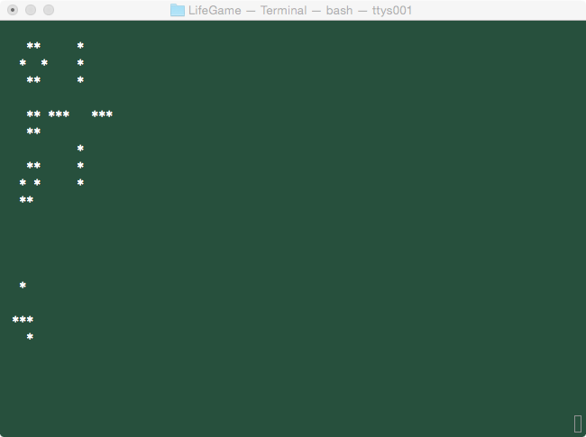

# LifeGame (C++)
C++にて[ライフゲーム](http://ja.wikipedia.org/wiki/%E3%83%A9%E3%82%A4%E3%83%95%E3%82%B2%E3%83%BC%E3%83%A0)を作成した。  

##ビルド方法
Unix系OSにてビルドすることを想定している。  
以下のコマンドが必要。  

- g++
- make

以下コマンドを実行することによってビルド可能。  

	%cd ./source  
	%make 

ビルドが成功すると以下のバイナリファイルが出来上がる。  

 - LifeGame
 

##実行方法
コマンドラインから以下を実行する。  

	%./source/LifeGame

実行すると以下のような画面となる。　　

このLifeGameは[curses](http://ja.wikipedia.org/wiki/Curses)を利用している。  
このLifeGame内でのコマンドを以下に示す。  

	q: LifeGame終了
	s: LifeGameスタート
	p: LifeGame一時停止
	i: セルの生死を設定（LifeGame一時停止状態の場合有効）
	k: カーソルを上へ移動
	j: カーソルを下へ移動
	h: カーソルを左へ移動
	l: カーソルを右へ移動

	※カーソルの移動はviと同じ

##プログラムソース
doxygenにてプログラムソース内のコメントから[ドキュメント](./html/index.html)を作成した。  

##UML
[クラス図とシーケンス図](./LifeGame.asta)を作成した。  

UML作成には[astah* community](http://astah.change-vision.com/ja/)を利用した。  

